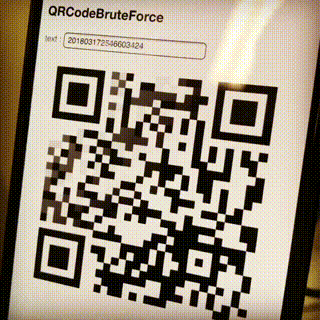

QRCodeBruteForce
====

How to build
----

    # setting up Apache Cordova
    $ curl -L git.io/nodebrew | perl - setup
    $ vi ~/.bashrc
      # append export PATH=$HOME/.nodebrew/current/bin:$PATH
    $ source ~/.bashrc
    $ nodebrew install v8.11.1
    
    $ npm install -g cordova
    $ npm install -g ios-sim
    $ npm install -g ios-deploy
    
    $ mkdir -p ~/work
    $ cd ~/work
    $ git clone https://github.com/yoggy/QRCodeBruteForce.git
    $ cd QRCodeBruteForce
    $ cordova prepare

    # for Android
    $ cordova requirements android
    $ cordova build android --debug
    $ vi platforms/android/project.properties
      # change to target=android-23
    $ vi platforms/android/app/src/main/AndroidManifest.xml
      # change to <uses-sdk android:minSdkVersion="16" android:targetSdkVersion="23" />
    $ cordova run android 

    # for iOS
    $ cordova requirements ios
    $ cordova build ios
    $ open platforms/ios/*.xcodeproj
      # setup code signing team on xcode
    $ cordova run ios --device

Copyright and license
----
Copyright (c) 2018 yoggy

Released under the [MIT license](LICENSE.txt)
